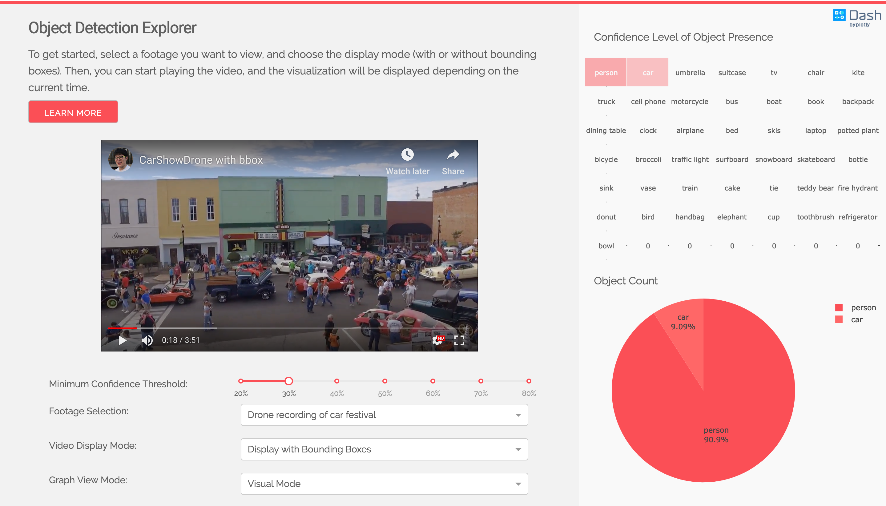
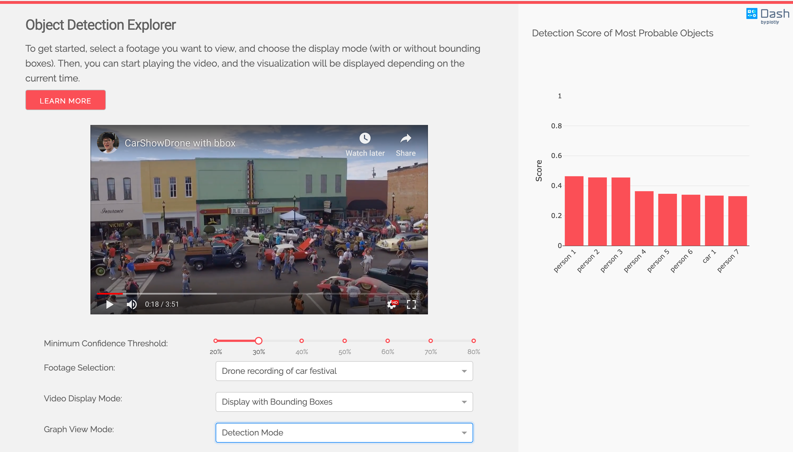

# Dash Object Detection Explorer

This is a demo of the DashR interactive R framework developed by [Plotly](https://plot.ly/).

DashR abstracts away all of the technologies and protocols required to build an interactive web-based application and is a simple and effective way to bind a user interface around your R code. To learn more check out our [documentation](https://dashr-docs.herokuapp.com/).

Try out the [demo app here](https://dash-object-detection.plot.ly/). (Will be replaced with a corresponding link.)


## Getting Started

### Using the demo 

To get started, select a footage you want to view, and choose the display mode (with or without bounding boxes). Then, you can start playing the video, and the visualization will be displayed depending on the current time.

### Running the app locally
 
Clone the git repo.
```
git clone https://github.com/plotly/dashR-object-detection.git

```

Open your RStudio IDE and set your working directory.
```
setwd("<path-where-the-folder-is>/dashR-object-detection")
```

Run the init.R script to have your packages installed.
```
source('<path-where-the-folder-is>/dashR-object-detection/init.R', echo=TRUE)
```
Download dashPlayer_0.0.1.tar file so that you can locally install DashPlayer in R.

Run the app in RStudio Console:
```
 source('<path-where-the-folder-is>/dashR-object-detection/app.R', echo=TRUE)
```

## About the app
The videos are displayed using a community-maintained Dash video component. It is made by two Plotly community contributors. You can find the [source code here](https://github.com/SkyRatInd/Video-Engine-Dash).

All videos used are open-sourced under Creative Commons. The [original links can be found here](data/original_footage.md).

### Model
The object detection model is the MobileNet v1, made by Google and trained on the COCO dataset. You can find their implementation on their [official Github repo](https://github.com/tensorflow/models/blob/master/research/slim/nets/mobilenet_v1.md). You are encouraged to try this app with other models.

### Bounding Box Generation
The data displayed in the app are pregenerated for demo purposes. To generate the csv files containing the objects detected for each frame, as well as the output video with bounding boxes, please refer to `utils/generate_video_data.py`. You will need the latest version of tensorflow and OpenCV, as well as the frozen graph `ssd_mobilenet_v1_coco`, that you can [download in the Model Zoo](https://github.com/tensorflow/models/blob/master/research/object_detection/g3doc/detection_model_zoo.md). Make sure to place the frozen graph inside the same folder as `generate_video_data.py`, i.e. `utils`.

### Difference between the python version and the R version
The R version has 3 modes instead of two modes: (Visual Mode & Confidence Mode & Detection Mode) in lieu of 2 modes (Visual Mode & Detection Mode).

The heatmap component now has a separate mode with two columns of labels written below the graph. It was a sacrifice in terms of design aspect at the benefit of greater performance and stability.

## Built With

* [DashR](https://dash.plot.ly/) - Main server and interactive components
* [Plotly R](https://plot.ly/r/) - Used to create the interactive plots
* [OpenCV](https://docs.opencv.org/) - Create the video with bounding boxes
* [Tensorflow](https://www.tensorflow.org/api_docs/) - Generate the bounding box data

## Contributing

Please read [CONTRIBUTING.md](CONTRIBUTING.md) for details on our code of conduct, and the process for submitting pull requests to us.

## Authors for the Python version of this app

* **Xing Han Lu** - *Initial Work* - [@xhlulu](https://github.com/xhlulu)
* **Yi Cao** - *Restyle* - [@ycaokris](https://github.com/ycaokris)

## Authors for the app
* **Dan Yunheum Seol** - *Initial Work* - [@dan-seol](https://github.com/dan-seol)

See also the list of [contributors](https://github.com/your/project/contributors) who participated in this project.

## License

This project is licensed under the MIT License - see the [LICENSE.md](LICENSE.md) file for details

## Screenshots




