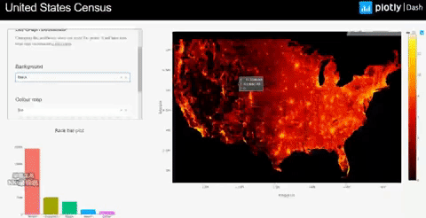
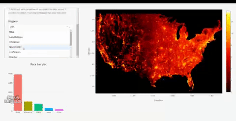
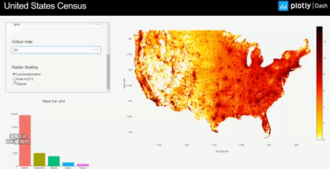

# dashr-rasterizer
# Rasterizer

This is a Dash app with large data visualization by package `rasterizer`. The data "USA census" can be downloaded through the instruction from `datashader` Github https://github.com/pyviz/datashader and the parquet files can be found in "../dash-datashader/datashader-examples/data/census2010.parq". 

Note that the data consists of 3 variables, "easting" (longitude), "northing" (latitude) and "race" with 300 million observations, a file size of 7.36GB loading in R.

## About this app:

The graph in this map represents USA census. It is constructed only by points, no lines, no polygons.

#### Zoom in and out



#### Selection



#### Reduction method



### Using the demo

#### Running the app locally

Clone the `git` repo and `cd` to the root directory:

```
git clone https://github.com/plotly/dash-sample-apps
cd dash-sample-apps/apps/dashr-rasterizer
```
Launch R, then install the required package dependencies in the default location:

```
remotes::install_github("plotly/dash")
remotes::install_github("plotly/dash-html-components")
remotes::install_github("plotly/dash-core-components")
remotes::install_github("plotly/rasterizer")

install.packages("reticulate")
install.packages("data.table")
```

Download data and store them in `dash-sample-apps/apps/dashr-rasterizer/data`. Alternatively, replace `filename <- paste0("data/part.", i, ".parquet")` to `filename <- paste0("yourpath/part.", i, ".parquet")` in app.R. Then, run the app, either interactively in R or RStudio, or by using the command line:
```
Rscript app.R
```

Finally, open your browser and enter the URL http://127.0.0.1:8050. 